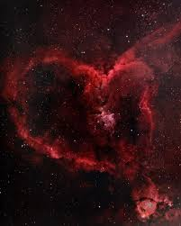
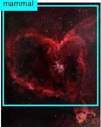
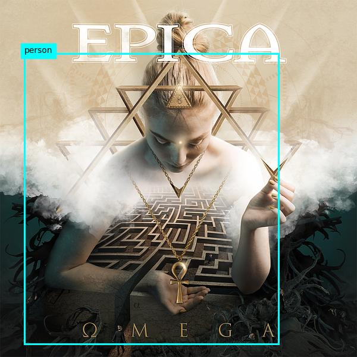
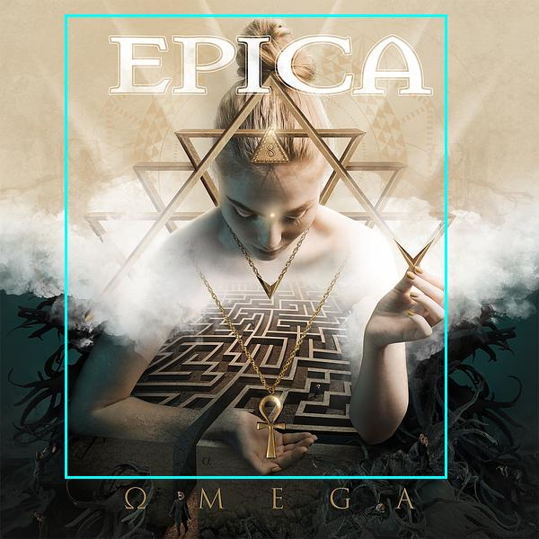
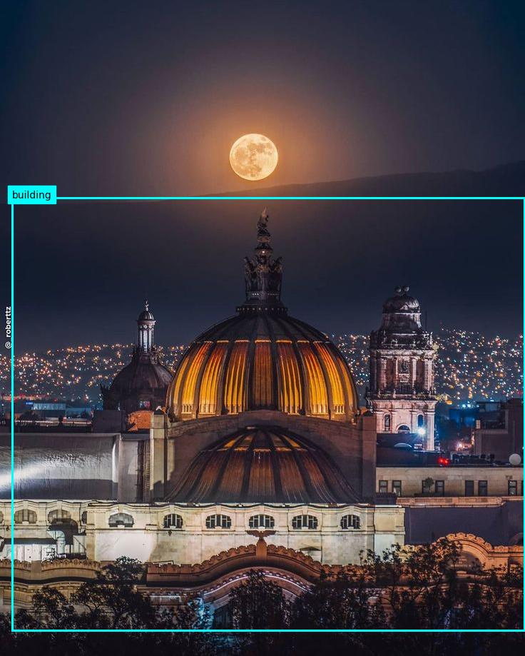

# ***Respuestas obtenidas del análisis de cada imagen.***

### **Imagen Galaxia.jpeg.**

Analyzing images/Galaxia.jpeg

**Caption:**
Caption: "a red cloud in space" (confidence: 67.48%)

**Dense Captions:**
 Caption: "a red cloud in space" (confidence: 68.33%)
 Caption: "a red cloud in space" (confidence: 69.04%)
 Caption: "a red head with black glasses" (confidence: 54.45%)
 Caption: "a red and black sky" (confidence: 65.64%)
 Caption: "a red and black background" (confidence: 67.80%)

**Tags:**
 Tag: "nebula" (confidence: 94.42%)
 Tag: "universe" (confidence: 92.76%)
 Tag: "outer space" (confidence: 92.47%)
 Tag: "space" (confidence: 91.22%)
 Tag: "galaxy" (confidence: 89.90%)
 Tag: "astronomy" (confidence: 89.85%)
 Tag: "astronomical object" (confidence: 88.10%)
 Tag: "star" (confidence: 84.96%)
 Tag: "constellation" (confidence: 84.18%)
 Tag: "nature" (confidence: 60.72%)
 Tag: "red" (confidence: 53.39%)

**Objects in image:**
 "mammal" (confidence: 53.00%)

**Annotating objects...**

Result saved in:  Galaxia.jpg

 ### **Imagen EPICA_OMEGA.jpg.**

 [EPICA](images/EPICA_OMEGA.jpg)

 Analyzing images/EPICA_OMEGA.jpg

**Caption:**
Caption: "a woman holding a triangle necklace" (confidence: 62.35%)

**Dense Captions:**
 Caption: "a woman holding a triangle necklace" (confidence: 62.35%)
 Caption: "a woman holding a sword" (confidence: 71.93%)

**Tags:**
 Tag: "text" (confidence: 97.70%)
 Tag: "poster" (confidence: 96.00%)
 Tag: "art" (confidence: 94.71%)
 Tag: "human face" (confidence: 89.69%)
 Tag: "design" (confidence: 40.79%)

**Objects in image:**
 "person" (confidence: 63.20%)

**Annotating objects...**

Result saved in:  EPICA_OMEGA.jpg

**People in image:**
 "{'x': 72, 'y': 16, 'w': 425, 'h': 516}" (confidence: 68.54%)

**Annotation objects...**

Result saved in:  EPICA_OMEGA_person.jpg

### **Imagen Moon.jpg**

[Moon](images/Moon.jpg)

Analyzing images/Moon.jpg

**Caption:**
Caption: "a building with a dome and a city in the background" (confidence: 68.12%)

**Dense Captions:**
 Caption: "a building with a dome and a city in the background" (confidence: 68.12%)
 Caption: "a full moon in the sky" (confidence: 76.73%)
 Caption: "a close up of a roof" (confidence: 71.53%)
 Caption: "a building with a bird on top of it" (confidence: 64.97%)
 Caption: "a dome with lights on" (confidence: 62.39%)
 Caption: "a large building with a dome and a city in the background" (confidence: 71.23%)
 Caption: "a building with a dome" (confidence: 66.83%)
 Caption: "a dome with a statue on top" (confidence: 73.28%)
 Caption: "a statue with a tower" (confidence: 55.88%)
 Caption: "a moon over a city" (confidence: 72.76%)

**Tags:**
 Tag: "moon" (confidence: 98.59%)
 Tag: "building" (confidence: 97.99%)
 Tag: "sky" (confidence: 92.61%)
 Tag: "outdoor" (confidence: 91.27%)
 Tag: "night" (confidence: 84.40%)
 Tag: "tower" (confidence: 68.99%)
 Tag: "dome" (confidence: 65.60%)
 Tag: "full moon" (confidence: 64.11%)
 Tag: "city" (confidence: 60.86%)
 Tag: "light" (confidence: 46.22%)

**Objects in image:**
 "building" (confidence: 55.20%)

**Annotating objects...**

Result saved in:  Moon.jpg

